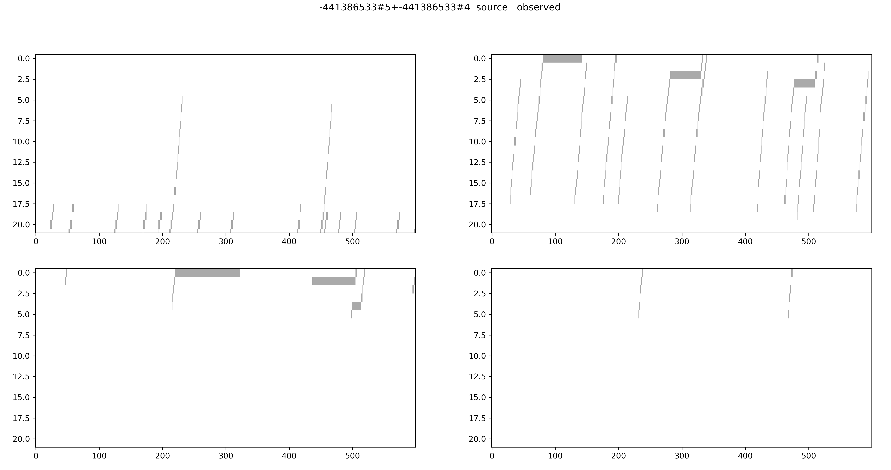
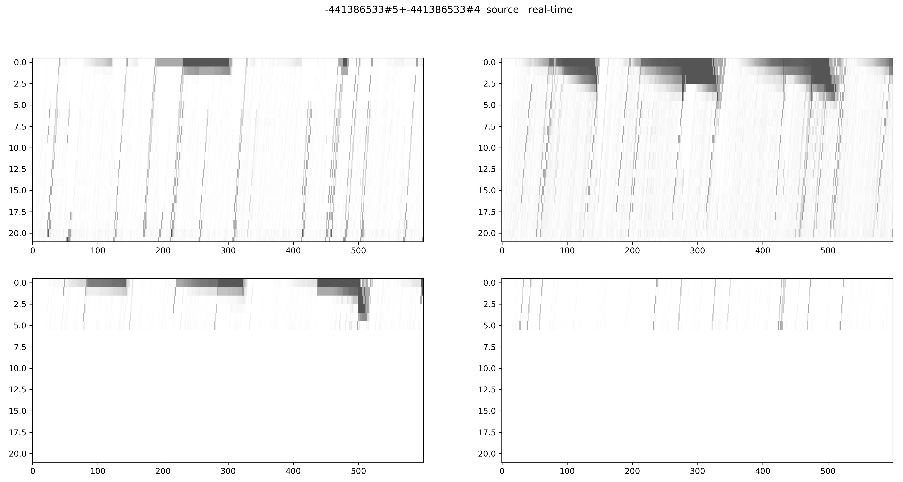

# Real-time traffic state estimation using the particle filter

## Corridor through movement

### Time-space diagram

### Density matrix ground truth

### Observed matrix 

### Estimation matrix

## Single link scenario

### Time-space diagram

### Density matrix ground truth

### Observed density matrix

### Real-time estimated density matrix

