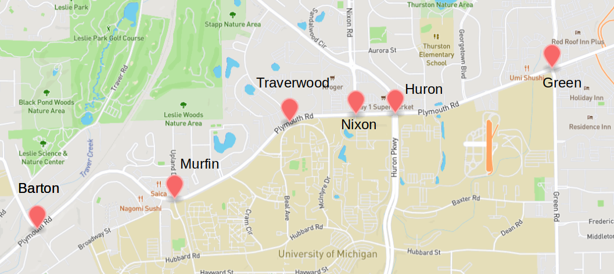
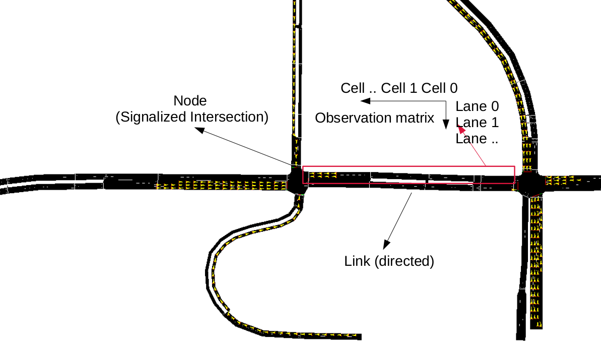
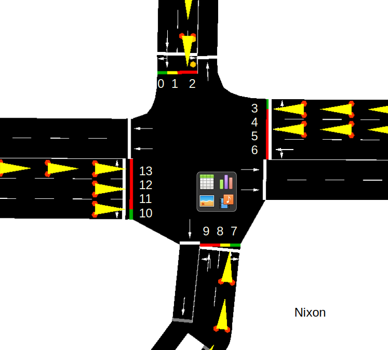
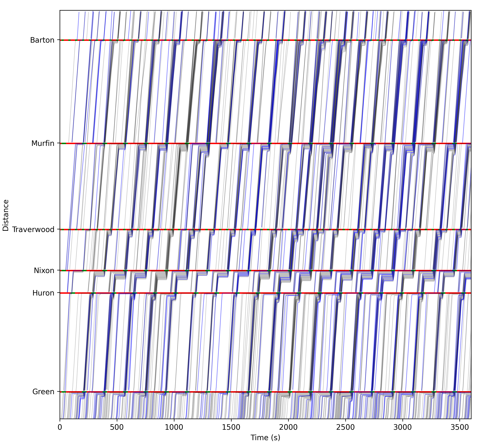

# Traffic Environment of Plymouth Rd., Ann Arbor MI.



## Usage

This environment follows the framework of [openai.gym](https://gym.openai.com/).

```python
env = SignalizedNetwork()         # Initiate a new environment
env.seed(-1)                      # Set a random seed
while True: 
    action = [0, 0, 0, 0, 0, 0]   # Input phase id for each intersections
    obs, reward, terminate, _ = env.step(action)
    if terminate:
        break
env.close()
# env.reset()                     # to restart a new simulation
```

## Observation

The observation returns a ```dict()``` contains all the density matrices of the links and the current signal state.

File ```observation_guidance.json``` in the folder ```sumo``` provided some information about the format of the observation. For example, the signal state follows the following sequence:

```json
{
  "signals": [
    "62477148",           
    "62500567",
    "62500824",  
    "62532012",
    "62606176",
    "767530322"
  ]
}
```

## Action

The input action is list with 6 integer values for the phase id for each intersection.

```python
env = SignalizedNetwork()
env.action_space = gym.Spaces.MultiDiscrete([9 3 9 3 9 9])

```
Signalized intersection list

| Signal Id | Intersection Name | Types | Number of Phases |
|-----------|-------------------|-------| -----------------|
|62477148 |  Nixon   | Four-legs | 9 |
|62500567 | Barton   | Three-legs | 3 |
| 62500824 | Huron | Four-legs | 9 |
| 62532012  | Traverwood | Three-legs | 3 |
| 62606176  | Green | Four-legs | 9|
| 767530322 | Murfin | Three-legs | 3|

## Signal Phase and Network Topology



Phases of an intersection is defined in the file ```plymouthv8.net.xml```:

```xml
<tlLogic id="62477148" type="static" programID="0" offset="0">
    <phase duration="20"  state="grrrgrrgrrrgrr"/>
    <phase duration="20"  state="gGGGgrrgrrrgrr"/>
    <phase duration="20"  state="gGGrgrrgGGrgrr"/>
    <phase duration="20"  state="grrGgrrgrrGgrr"/>
    <phase duration="20"  state="grrrgrrgGGGgrr"/>
    <phase duration="20"  state="grrrgGGgrrrgrr"/>
    <phase duration="20"  state="grrrgGrgrrrgGr"/>
    <phase duration="20"  state="grrrgrGgrrrgrG"/>
    <phase duration="20"  state="grrrgrrgrrrgGG"/>
</tlLogic>
```



Line 1-9 correponds to Phase 1-Phase 9. Right-turn movement is regarded as green light all the time (yield to all the other directions). 

## Set Configuration File

The configuration file is located at ```traffic_envs.config.py```, here are some important configuration settings:

```python
# Gui mode, true to use traci, false to use libsumo, check your installment of libsumo. 
# If libsumo is not installed correctly, it will use traci instead.
GUI_MODE = True
# Random mode, true to use random demand, false to use the fixed random seed
RANDOM_MODE = True
```

## Output 

### Corridor time-space diagram


